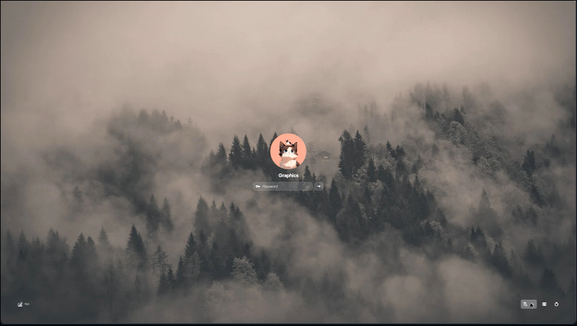
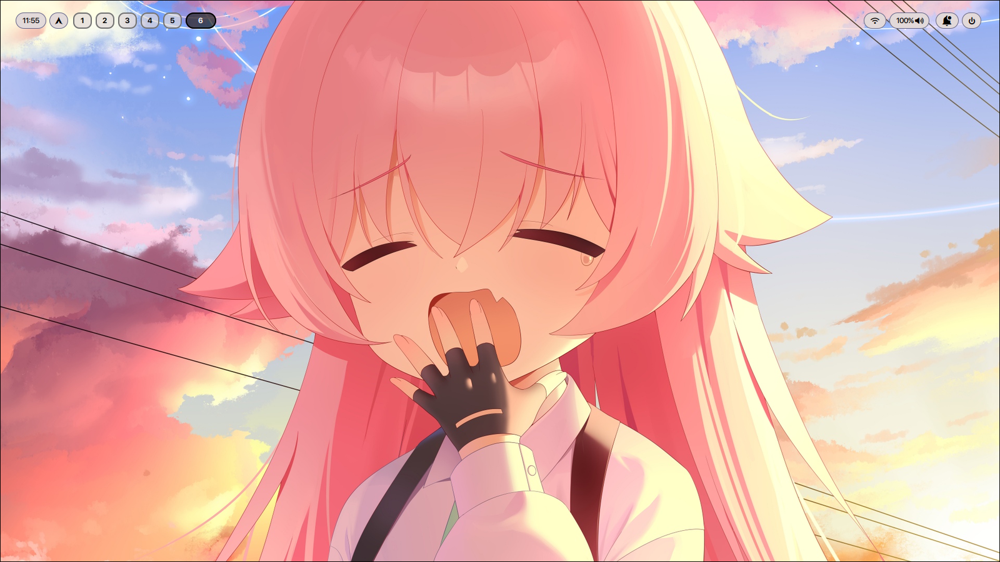
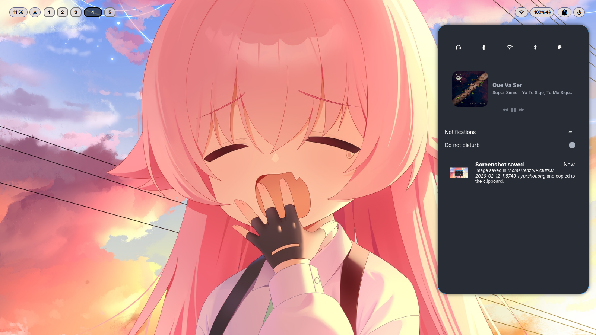
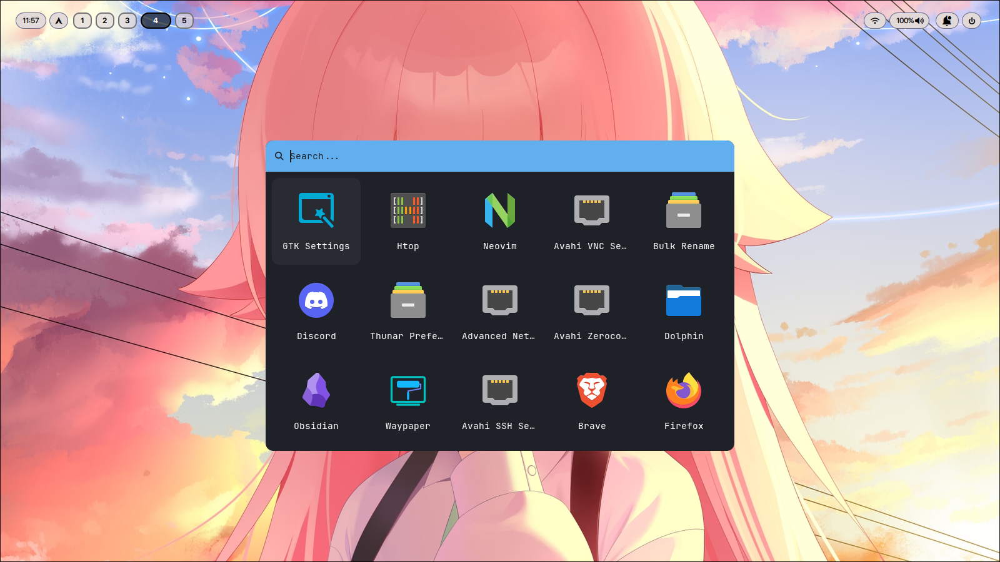
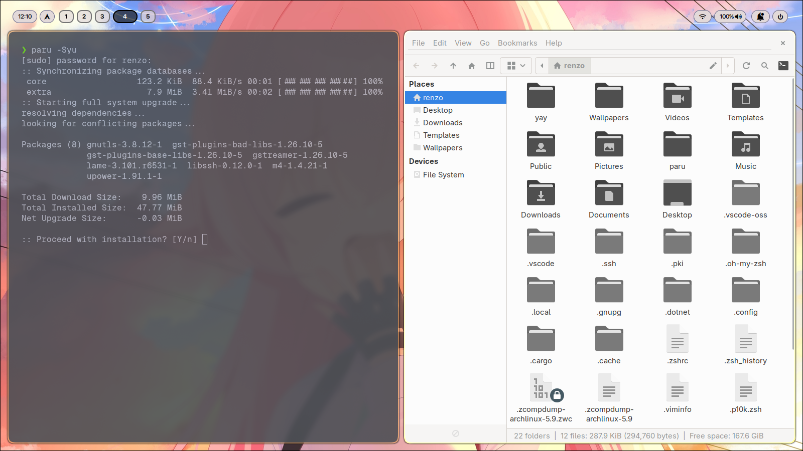
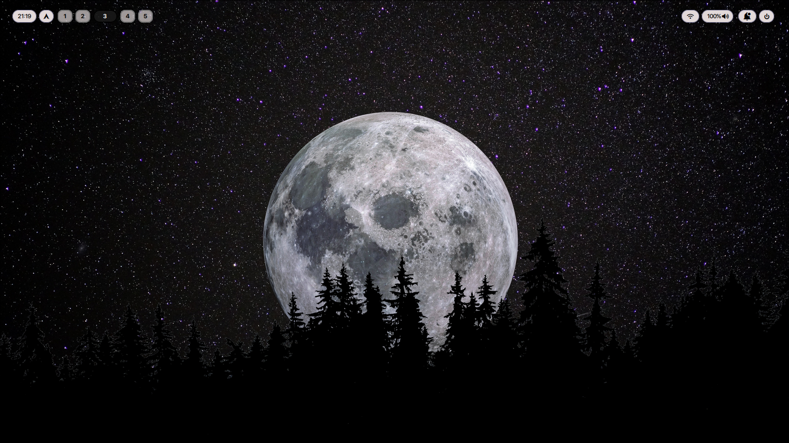

# 🚀 Arch + Hyprland Dotfiles


Configuración personal de **Arch Linux** con un entorno moderno basado en **Hyprland** y **Wayland**. Este setup está diseñado para ser minimalista, rápido y visualmente atractivo.

## 🖼️ Galería

<div style="display: flex; overflow-x: auto; gap: 10px;">
  
  
  
  
  
  
</div>

**Nota:** Tema SilentSDDM. Créditos a [uiriansan](https://github.com/uiriansan/SilentSDDM) 

---

## 🛠️ Componentes del Sistema

| Categoría | Herramienta | Descripción |
| :--- | :--- | :--- |
| **Window Manager** | [Hyprland](https://hyprland.org/) | Compositor dinámico de tiles para Wayland. |
| **Login Manager** | **SDDM** | Gestor de inicio de sesión gráfico. |
| **Terminal** | [Ghostty](https://mitchellh.com/ghostty) | Emulador de terminal de alto rendimiento. |
| **Barra de Estado** | Waybar | Barra superior informativa y modular. |
| **Lanzador** | Rofi | Menú para aplicaciones y comandos. |
| **Notificaciones** | SwayNC | Centro de notificaciones nativo de Wayland. |
| **Shell** | Zsh | Configuración personalizada con `.zshrc`. |

---

## 📂 Estructura del Repositorio

A continuación se describen las carpetas principales de este repositorio:

* **`sddm/`**: Temas y configuración del gestor de arranque.
* **`thunar/`**: Preferencias del explorador de archivos.
* **`hypr/`**: Archivos de configuración de Hyprland (keybinds, monitores, reglas).
* **`waybar/`**: Diseño y estilos CSS de la barra superior.
* **`ghostty/`**: Ajustes de la terminal.
* **`rofi/`**: Temas para el lanzador de aplicaciones.
* **`swaync/`**: Estilo del centro de notificaciones.
* **`qcalculate/`**: Perfiles de la calculadora técnica.
* **`Wallpapers/`**: Fondos de pantalla seleccionados.
* **`fastfetch/`**: Configuración del visualizador de info del sistema.
* **`fonts/`**: Fuentes necesarias para la correcta visualización de iconos.
* **`.zshrc`**: Alias y complementos de la shell.
* **`waypaper/`**: Ajustes del gestor de fondos.

---

## 🚀 Instalación

1.  **Clona el repositorio:**
    ```bash
    git clone [https://github.com/rembodev/tu-repositorio.git](https://github.com/rembodev/tu-repositorio.git)
    cd tu-repositorio
    ```

2.  **Aplica las configuraciones:**
    Copia los archivos a tu carpeta `.config` (se recomienda usar enlaces simbólicos):
    ```bash
    cp -r * ~/.config/
    sudo cp -r sddm/ /usr/share/sddm/themes/  # Para aplicar el tema de login
    ```

3.  **Habilitar servicios:**
    Asegúrate de tener habilitado SDDM para el inicio automático:
    ```bash
    sudo systemctl enable sddm
    ```

---

## ⌨️ Atajos Rápidos

| Atajo | Acción |
| :--- | :--- |
| `SUPER + RETURN` | Abrir Terminal (**Ghostty**) |
| `SUPER + E` | Abrir Explorador (**Thunar**) |
| `SUPER + B` | Abrir Navegador (**Firefox**) |
| `SUPER + D` | Lanzador de aplicaciones (**Rofi**) |
| `SUPER + Q` | Cerrar ventana activa |
| `Print` | Captura de pantalla (Salida activa) |
| `SUPER + SHIFT + S` | Captura de pantalla (Región seleccionada) |
| `SUPER + SHIFT + = / -` | Zoom In / Out (**Hypr-zoom**) |

---

## 📦 Ecosistema de Aplicaciones
Setup completo para desarrollo, estudio y multimedia:

* **Dev & Ops:** `VS Code`, `Ghostty`, `Git`.
* **Productividad:** `Pomotroid` (Pomodoro), `Obsidian` (Notes), `Qalculate!`.
* **Multimedia:** `Spotify`, `VLC`, `MPV`, `OBS Studio`.
* **Navegación:** `Firefox`.
* **Utilidades:** `Hyprshot` (Screenshots), `Hypr-zoom` (Magnificación de pantalla).

---

Hecho por [rembodev](https://github.com/rembodev)
